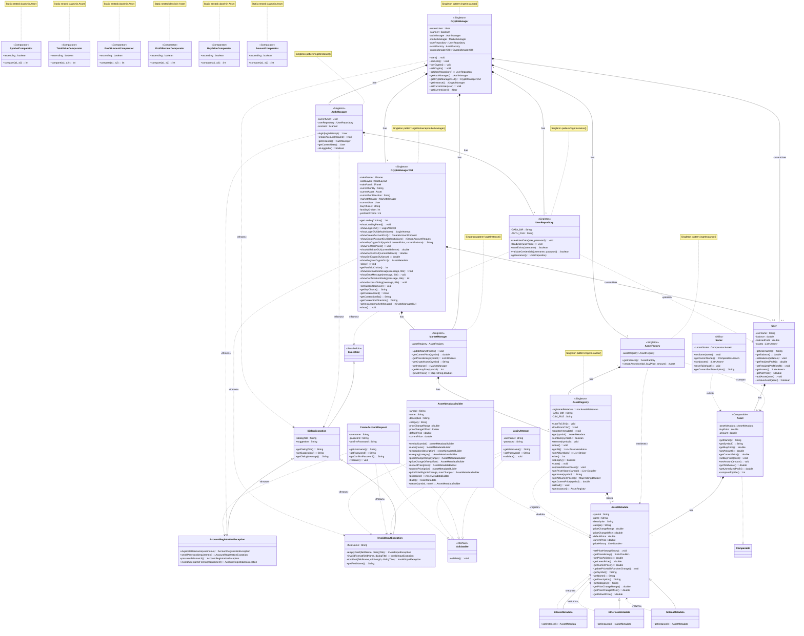

```mermaid

classDiagram
direction TB

%% ===== EXCEPTION HIERARCHY =====
class Exception {
    <<Java built-in>>
}

    class DialogException {
        +dialogTitle : String
        +suggestion : String
        +getDialogTitle() : String
        +getSuggestion() : String
        +getDialogMessage() : String
    }

    Exception <|-- DialogException

    class AccountRegistrationException {
        +duplicateUsername(username) : AccountRegistrationException
        +weakPassword(requirement) : AccountRegistrationException
        +passwordMismatch() : AccountRegistrationException
        +invalidUsernameFormat(requirement) : AccountRegistrationException
    }

    DialogException <|-- AccountRegistrationException

    class InvalidInputException {
        +fieldName : String
        +emptyField(fieldName, dialogTitle) : InvalidInputException
        +invalidFormat(fieldName, dialogTitle) : InvalidInputException
        +tooShort(fieldName, minLength, dialogTitle) : InvalidInputException
        +getFieldName() : String
    }

    DialogException <|-- InvalidInputException

%% ===== INTERFACES =====
class Validatable {
<<interface>>
+validate() : void
}

%% ===== USER & AUTHENTICATION =====
class User {
-username : String
-balance : double
-realizedProfit : double
-assets : List~Asset~
+getUsername() : String
+getBalance() : double
+setBalance(balance) : void
+getRealizedProfit() : double
+setRealizedProfit(profit) : void
+getAssets() : List~Asset~
+getNetProfit() : double
+addAsset(asset) : void
+removeAsset(asset) : boolean
}

    class LoginAttempt {
        -username : String
        -password : String
        +getUsername() : String
        +getPassword() : String
        +validate() : void
    }

    LoginAttempt ..|> Validatable

    class CreateAccountRequest {
        -username : String
        -password : String
        -confirmPassword : String
        +getUsername() : String
        +getPassword() : String
        +getConfirmPassword() : String
        +validate() : void
    }

    CreateAccountRequest ..|> Validatable

%% ===== ASSET HIERARCHY =====
class AssetMetadata {
-symbol : String
-name : String
-description : String
-category : String
-priceChangeRange : double
-priceChangeOffset : double
-defaultPrice : double
-currentPrice : double
-priceHistory : List~Double~
+setPriceHistory(history) : void
+getPriceHistory() : List~Double~
+getPriceAt(index) : double
+getLatestPrice() : double
+getCurrentPrice() : double
+updatePriceWithRandomChange() : void
+getSymbol() : String
+getName() : String
+getDescription() : String
+getCategory() : String
+getPriceChangeRange() : double
+getPriceChangeOffset() : double
+getDefaultPrice() : double
}

    class BitcoinMetadata {
        +getInstance() : AssetMetadata
    }

    class EthereumMetadata {
        +getInstance() : AssetMetadata
    }

    class SolanaMetadata {
        +getInstance() : AssetMetadata
    }

    AssetMetadata <|-- BitcoinMetadata
    AssetMetadata <|-- EthereumMetadata
    AssetMetadata <|-- SolanaMetadata

    class AssetMetadataBuilder {
        -symbol : String
        -name : String
        -description : String
        -category : String
        -priceChangeRange : double
        -priceChangeOffset : double
        -defaultPrice : double
        -currentPrice : double
        +symbol(symbol) : AssetMetadataBuilder
        +name(name) : AssetMetadataBuilder
        +description(description) : AssetMetadataBuilder
        +category(category) : AssetMetadataBuilder
        +priceChangeRange(range) : AssetMetadataBuilder
        +priceChangeOffset(offset) : AssetMetadataBuilder
        +defaultPrice(price) : AssetMetadataBuilder
        +currentPrice(price) : AssetMetadataBuilder
        +priceVolatility(minChange, maxChange) : AssetMetadataBuilder
        +price(price) : AssetMetadataBuilder
        +build() : AssetMetadata
        +create(symbol, name) : AssetMetadataBuilder
    }

    class Asset {
        -assetMetadata : AssetMetadata
        -buyPrice : double
        -amount : double
        +getName() : String
        +getSymbol() : String
        +getBuyPrice() : double
        +getAmount() : double
        +getCurrentPrice() : double
        +setBuyPrice(price) : void
        +setAmount(amount) : void
        +getTotalValue() : double
        +getUnrealizedProfit() : double
        +compareTo(other) : int
        <<Comparable>>
    }

    Asset "1" *-- "1" AssetMetadata : has
    Asset ..|> Comparable

%% ===== STATIC COMPARATOR CLASSES =====
class SymbolComparator {
+ascending : boolean
+compare(a1, a2) : int
<<Comparator>>
}

    class TotalValueComparator {
        +ascending : boolean
        +compare(a1, a2) : int
        <<Comparator>>
    }

    class ProfitAmountComparator {
        +ascending : boolean
        +compare(a1, a2) : int
        <<Comparator>>
    }

    class ProfitPercentComparator {
        +ascending : boolean
        +compare(a1, a2) : int
        <<Comparator>>
    }

    class BuyPriceComparator {
        +ascending : boolean
        +compare(a1, a2) : int
        <<Comparator>>
    }

    class AmountComparator {
        +ascending : boolean
        +compare(a1, a2) : int
        <<Comparator>>
    }

%% ===== SINGLETON MANAGERS =====
class AssetRegistry {
<<Singleton>>
-registeredMetadata : List~AssetMetadata~
-DATA_DIR : String
-CSV_FILE : String
+saveToCSV() : void
+loadFromCSV() : void
+register(metadata) : void
+get(symbol) : AssetMetadata
+contains(symbol) : boolean
+remove(symbol) : void
+clear() : void
+getAll() : List~AssetMetadata~
+getAllSymbols() : List~String~
+size() : int
+isEmpty() : boolean
+save() : void
+updateAllAssetPrices() : void
+getPriceHistory(symbol) : List~Double~
+getName(symbol) : String
+getAllCurrentPrices() : Map~String,Double~
+getCurrentPrice(symbol) : double
+reload() : void
+getInstance() : AssetRegistry
}

    class AssetFactory {
        <<Singleton>>
        -assetRegistry : AssetRegistry
        +getInstance() : AssetFactory
        +createAsset(symbol, buyPrice, amount) : Asset
    }

    class Sorter {
        <<Utility>>
        -currentSorter : Comparator~Asset~
        +setSorter(sorter) : void
        +getCurrentSorter() : Comparator~Asset~
        +sort(assets) : List~Asset~
        +resetToDefault() : void
        +getCurrentSortDescription() : String
    }

    class MarketManager {
        <<Singleton>>
        -assetRegistry : AssetRegistry
        +updateMarketPrices() : void
        +getCurrentPrice(symbol) : double
        +getPriceHistory(symbol) : List~Double~
        +getCryptoName(symbol) : String
        +getInstance() : MarketManager
        +getHistorySize(symbol) : int
        +getAllPrices() : Map~String,Double~
    }

    class AuthManager {
        <<Singleton>>
        -currentUser : User
        -userRepository : UserRepository
        -scanner : Scanner
        +login(loginAttempt) : User
        +createAccount(request) : void
        +getInstance() : AuthManager
        +getCurrentUser() : User
        +isLoggedIn() : boolean
    }

    class UserRepository {
        <<Singleton>>
        -DATA_DIR : String
        -AUTH_FILE : String
        +saveUserData(user, password) : void
        +loadUser(username) : User
        +userExists(username) : boolean
        +validateCredentials(username, password) : boolean
        +getInstance() : UserRepository
    }

    class CryptoManager {
        <<Singleton>>
        -currentUser : User
        -scanner : Scanner
        -authManager : AuthManager
        -marketManager : MarketManager
        -userRepository : UserRepository
        -assetFactory : AssetFactory
        -cryptoManagerGUI : CryptoManagerGUI
        +start() : void
        +sortLots() : void
        +buyCrypto() : void
        +sellCrypto() : void
        +getUserRepository() : UserRepository
        +getAuthManager() : AuthManager
        +getCryptoManagerGUI() : CryptoManagerGUI
        +getInstance() : CryptoManager
        +setCurrentUser(user) : void
        +getCurrentUser() : User
    }

%% ===== GUI (SIMPLIFIED) : =====
class CryptoManagerGUI {
<<Singleton>>
-mainFrame : JFrame
-cardLayout : CardLayout
-mainPanel : JPanel
-currentSortBy : String
-currentAsset : Asset
-currentSortDirection : String
-marketManager : MarketManager
-currentUser : User
-buyChoice : String
-landingChoice : int
-portfolioChoice : int
+getLandingChoice() : int
+showLandingPanel() : void
+showLoginGUI() : LoginAttempt
+showLoginGUI(defaultValues) : LoginAttempt
+showCreateAccountGUI() : CreateAccountRequest
+showCreateAccountGUI(defaultValues) : CreateAccountRequest
+showBuyCryptoGUI(symbol, currentPrice, currentBalance) : String
+showPortfolioPanel() : void
+showWithdrawGUI(currentBalance) : double
+showDepositGUI(currentBalance) : double
+showSellCryptoGUI(asset) : double
+showRegisterCryptoGUI() : AssetMetadata
+close() : void
+getPortfolioChoice() : int
+showInformationMessage(message, title) : void
+showErrorMessage(message, title) : void
+showConfirmationDialog(message, title) : int
+showSuccessDialog(message, title) : void
+setCurrentUser(user) : void
+getBuyChoice() : String
+getCurrentAsset() : Asset
+getCurrentSortBy() : String
+getCurrentSortDirection() : String
+getInstance(marketManager) : CryptoManagerGUI
+show() : void
}

%% ===== KEY RELATIONSHIPS =====

%% CryptoManager dependencies (composition)
CryptoManager "1" *-- "1" AuthManager : has
CryptoManager "1" *-- "1" MarketManager : has
CryptoManager "1" *-- "1" UserRepository : has
CryptoManager "1" *-- "1" AssetFactory : has
CryptoManager "1" *-- "1" CryptoManagerGUI : has
CryptoManager "1" *-- "0..1" User : currentUser

%% GUI dependencies
CryptoManagerGUI "1" *-- "1" MarketManager : has
CryptoManagerGUI "1" *-- "0..1" User : currentUser

%% Asset creation chain
AssetFactory "1" *-- "1" AssetRegistry : has
AssetFactory ..> Asset : «create»

%% MarketManager uses AssetRegistry
MarketManager "1" *-- "1" AssetRegistry : has

%% AuthManager dependencies
AuthManager "1" *-- "1" UserRepository : has

%% UserRepository saves/loads Users with Assets
UserRepository ..> User : «persist»
User "1" *-- "0..*" Asset : has

%% Asset creation flow
AssetFactory ..> AssetMetadata : «retrieves»
AssetRegistry "1" *-- "0..*" AssetMetadata : stores

%% Sorter uses Asset's comparators
Sorter ..> Asset : «uses»

%% Validatable implementations
LoginAttempt ..|> Validatable
CreateAccountRequest ..|> Validatable

%% Exception throwing relationships
AuthManager ..> DialogException : «throws»
AuthManager ..> AccountRegistrationException : «throws»
UserRepository ..> Exception : «throws»
LoginAttempt ..> InvalidInputException : «throws»
CreateAccountRequest ..> AccountRegistrationException : «throws»
CreateAccountRequest ..> InvalidInputException : «throws»
AssetMetadataBuilder ..> InvalidInputException : «throws»
CryptoManagerGUI ..> InvalidInputException : «throws»
CryptoManager ..> DialogException : «throws»

%% Registry registration
AssetRegistry ..> AssetMetadata : «register»
BitcoinMetadata ..> AssetMetadata : «returns»
EthereumMetadata ..> AssetMetadata : «returns»
SolanaMetadata ..> AssetMetadata : «returns»

%% Factory creation
AssetMetadataBuilder ..> AssetMetadata : «builds»

%% Singleton getInstance methods
note for AssetRegistry "Singleton pattern:\ngetInstance()"
note for AssetFactory "Singleton pattern:\ngetInstance()"
note for MarketManager "Singleton pattern:\ngetInstance()"
note for AuthManager "Singleton pattern:\ngetInstance()"
note for UserRepository "Singleton pattern:\ngetInstance()"
note for CryptoManager "Singleton pattern:\ngetInstance()"
note for CryptoManagerGUI "Singleton pattern:\ngetInstance(marketManager)"

%% Comparator relationships (static nested classes)
note for SymbolComparator "Static nested class\nin Asset"
note for TotalValueComparator "Static nested class\nin Asset"
note for ProfitAmountComparator "Static nested class\nin Asset"
note for ProfitPercentComparator "Static nested class\nin Asset"
note for BuyPriceComparator "Static nested class\nin Asset"
note for AmountComparator "Static nested class\nin Asset"
```